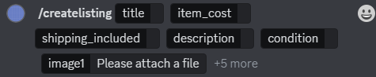
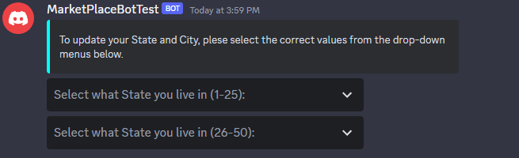
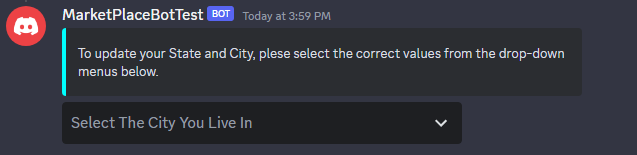

# Marketplace (Discord Bot)
Marketplace aims to simplify the process of buying/selling/trading items. This user-friendly tool is built using JDA (Java Discord API), and all data is stored in MongoDB.
## Features
Unlike other online marketplaces or discussion forums, our bot targets Discord users who would like to exchanges goods within their niche interest groups, narrowing the search for sellers/buyers of specific goods. The bot streamlines sharing and filtering items being sold, making the selling experience <b>easier</b> and the search for items <b>faster</b>.

Marketplace Bot has the following features:
- [Creating a Listing](#creating-a-listing): Users can create their own listings by filling out a pre-made template that includes the essential details of the item being sold.
- [Viewing Your Own Listings](#viewing-your-own-listings): Users can review the listings they have already posted and delete the ones that are no longer active.
- [Search and Sort for Listings](#search-and-sort-for-listings): Users can search for specific listings that contain a keyword in the title, and sort through them by date and price.
- [Updating Your Location](#updating-your-location): Users can add or update their approximate location that is displayed along with their listing, which informs other potential buyers where the item may be picked up/shipped from.
- [Creating a New Channel](#creating-a-new-trading-channel): A text channel with special permission restrictions where users can post their listings.

## Bot Documentation
To view all documentation related to our bot, please use the following links:

[Group Bear Shared Google Drive](https://drive.google.com/drive/folders/1Sn4PxEXHuTDNMWvR-0BYmb5M2VSLNGK6?usp=sharing)

[Group Bear Sprint Board](https://github.com/orgs/CS5500-S-2023/projects/65?query=is%3Aopen+sort%3Aupdated-desc)

[Group Bear GitHub Repository](https://github.com/CS5500-S-2023/team-bear)

# Getting Started
- This project was built in VS Code.
- Please see the build.gradle file for dependencies.
## Building and Deploying the Bot
<i>Skip these steps if using our [production bot](#join-our-production-server) </i>
1. Clone this repository to your local machine.
2. Create an Application at the Discord Developer Portal.
3. Generate an invite link for the application using the OAuth2 URL Generator with scopes as <b>bot</b> and bot permission set as <b>Administrator</b>.
4. Invite the bot into the server of choice.
5. Set the following environment variables or export these tokens:
- BOT_TOKEN: Your Discord bot token.
- MONGODB_URI: Your MongoDB URI.

After exporting the tokens or running the environment variables, run the bot by running `./gradlew run`.
## Join Our Production Server
Use the following invite link to join our Production Discord server: [Invite Link To Our Server](https://discord.gg/sFcdK3xj)

## Adding The Bot to a Server
Use the following invite link to add the bot to a server: [Bot Invite Link](https://discord.com/api/oauth2/authorize?client_id=1093746738361270373&permissions=8&scope=bot)

Upon adding the bot to a server, please see what happens when [bot joins server](#bot-joins--removed-from-server) below.

# Executing Commands
Below are the commands that users can
## Creating a Listing
`/createlisting` will show a template where the user can fill out accordingly. 
 

After filling out the template, the user can choose to edit, cancel, or post their listing. When posting the listing, the listing will be displaying in the designated trading channel. 

## Viewing Your Own Listings
`/mylisting`: Sends the user a direct message containing all their listings within the server. User can choose to delete their listing.
## Search and Sort Listings
`/searchlistings`: Asks the user to type in a keyword to populate listings containing the keyword in the title. Users can sort their search with a select menu.
## Updating Your Location
`/updatelocation`: Sends the user a direct message with a select menu of States and Cities. 
 

## Creating a New Trading Channel
`/createtradingchannel`: Creates a new text-channel using a unique name of the user's choice. This channel has special permissions where only the bot can send messages. 

# Events
## Bot Joins / Removed From Server
- <b>When a bot joins</b>: First, the server owner will receive the following DM from the bot:

If the owner selects "Bot Can Create The Channel", the bot will attempt to create a new text channel named "trading-channel". If a channel with that name already exists OR if "I'll Create The Channel" is selected, the server owner MUST call the command `/createtradingchannel` to create the trading channel. The owner MUST input a custom, unique name for the channel when calling the command. If they do not and they enter a name that already is present in the server, they will have to call the command again until a unique name is given.

Second, each member of the server, including the owner, will receive a DM from the bot asking the member to select the State and City they are located in from drop-down menus. An exact location is not necessary. The bot tracks this information to later attach it to listings created by members.

- <b>When a bot leaves</b>: Only data within the server attached to the bot will be removed from the database. If the server owner decides to invite the bot back, previous information will no longer be available.
## Member Joins / Removed From Server
- <b>When a new member joins</b>: The bot will send a greeting to the user's direct messages and ask for user to update their location.
- <b>When a member is removed</b>: Only listings in the server belonging to the user will be removed from the database. The user will only be fully erased in the database if they do not belong to any other server containing the bot.

# Credits

Foundations of Computer Science @ NEU, Instructor: Alexander Lash

## Collaborators:
- Lena Duong
- Peter Tsanev
- Hanchen Zhang
